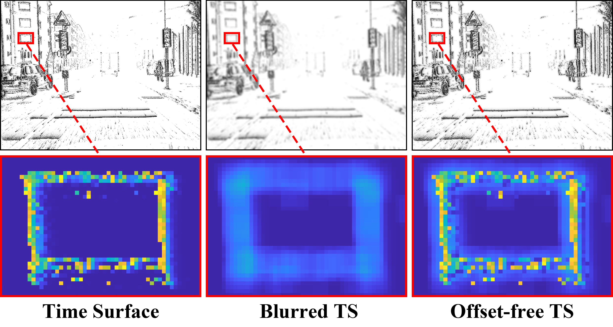

# ESVO2: Direct Visual-Inertial Odometry with Stereo Event Cameras

This repository delivers **ESVO2**, an event-based stereo visual-inertial odometry system built on top of our previous work ESVO [3]. It is a direct method that solves the tracking and mapping problems in parallel by leveraging the spatio-temporal coherence in the stereo event data. It alleviates ESVO's high computational complexity in mapping and address its degeneracy in camera pose tracking. To the best of our knowledge, the system is the first published work that achieves real-time performance using a standard CPU on event cameras of VGA pixel resolution. 

### **Video**

[](https://youtu.be/gmAU32Oeiv8) &nbsp;&nbsp;

### **Related Publications**

[1] **[ESVO2: Direct Visual-Inertial Odometry with Stereo Event Cameras](https://arxiv.org/abs/2410.09374)**, *Junkai Niu, Sheng Zhong, Xiuyuan Lu, Shaojie Shen, Guillermo Gallego, Yi Zhou*, IEEE Transactions on Robotics (T-RO), 2025. [PDF](https://arxiv.org/abs/2410.09374), [Video](https://youtu.be/gmAU32Oeiv8).

[2] **[IMU-Aided Event-based Stereo Visual Odometry](https://arxiv.org/abs/2405.04071)**, *Junkai Niu, Sheng Zhong, Yi Zhou*, ICRA 2024. [PDF](https://arxiv.org/pdf/2405.04071), [Video](https://youtu.be/hy25-nExD0E).

[3] **[Event-based Stereo Visual Odometry](https://arxiv.org/abs/2007.15548)**, *Yi Zhou, Guillermo Gallego, Shaojie Shen*, IEEE Transactions on Robotics (T-RO), 37(5):1433-1450, 2021. [Project page](https://sites.google.com/view/esvo-project-page/home), [PDF](https://arxiv.org/pdf/2007.15548), [Video](https://youtu.be/3CPPs1gz04k).

[4] **[Semi-dense 3D Reconstruction with a Stereo Event Camera](https://arxiv.org/abs/1807.07429)**, *Yi Zhou, Guillermo Gallego, Henri Rebecq, Laurent Kneip, Hongdong Li, Davide Scaramuzza*, ECCV 2018. [PDF](http://rpg.ifi.uzh.ch/docs/ECCV18_Zhou.pdf), [Poster](http://rpg.ifi.uzh.ch/docs/ECCV18_Zhou_poster.pdf), [Video](https://youtu.be/Qrnpj2FD1e4).

# 1. Installation

We have tested ESVO2 on machines with the following configurations

* Ubuntu 20.04 LTS + ROS Noetic + OpenCV 4.2 + Eigen 3.3.9 + Ceres 1.14.0

## 1.1 Driver Installation

To work with event cameras, especially for the Dynamic Vision Sensors (DVS/DAVIS), you need to install some drivers. 
Please follow the instructions (steps 1-3) at [rpg_dvs_ros](https://github.com/uzh-rpg/rpg_dvs_ros) before moving on to the next step. 
Note that you need to replace the name of the ROS distribution with the one installed on your computer.

We use catkin tools to build the code. You should have it installed during the driver installation.

If you have problems installing libcare, you can try the following command

```shell
sudo apt-get install software-properties-common
sudo add-apt-repository ppa:ubuntu-toolchain-r/test
sudo add-apt-repository ppa:inivation-ppa/inivation
sudo apt-get install libcaer-dev
```

## 1.2 Dependencies and ESVO2 Installation

You should have created a catkin workspace in Section 1.1. If not, please go back and create one.

**Clone this repository** into the `src` folder of your catkin workspace.

```shell
cd ~/catkin_ws/src 
git clone https://github.com/NAIL-HNU/ESVO2.git
```

Then **clone the required dependency** packages

```shell
sudo apt install libgflags
sudo apt install libgoogle-glog-dev
cd ~/catkin_ws/src
git clone https://github.com/catkin/catkin_simple.git
git clone https://github.com/uzh-rpg/rpg_dvs_ros.git
git clone https://github.com/ethz-asl/gflags_catkin.git
git clone https://github.com/ethz-asl/glog_catkin.git
git clone https://github.com/ethz-asl/minkindr.git 
git clone https://github.com/ethz-asl/eigen_catkin.git
git clone https://github.com/ethz-asl/eigen_checks.git
git clone https://github.com/ethz-asl/minkindr_ros.git
git clone https://github.com/ethz-asl/catkin_boost_python_buildtool.git
git clone https://github.com/ethz-asl/numpy_eigen.git
```

If you don't have a yaml library, please install one. But if you already have a yaml library, please do not install it repeatedly, as it will cause version conflicts.

```shell
# if you don't have a yaml
cd ~/catkin_ws/src 
git clone https://github.com/jbeder/yaml-cpp.git
cd yaml-cpp
mkdir build && cd build && cmake -DYAML_BUILD_SHARED_LIBS=ON ..
make -j
```

Finally **compile it**.

```shell
cd ~/catkin_ws
catkin_make
```

# 2. Usage

## 2.1 Time Surface and AA map

This package implements a node that constantly updates the stereo event maps (i.e., time surfaces). To launch it independently, open a terminal and run the command:

```shell
cd ~/catkin_ws
source devel/setup.bash
roslaunch image_representation image_representation.launch
```

Then play the input (already downloaded) bag file by running

```shell
rosbag play xxx.bag --clock
```

If lag occurs during the run, try to reduce the rate of rosbag

```shell
rosbag play xxx.bag --clock -r 0.5
```

## 2.2 Running the system on DSEC dataset

Since the rosbag with event and IMU data is not provided in the datasets, we repackage the required data as the input for the system.

You can access most of the rosbag files we repacked through the [download link](https://pan.baidu.com/s/1mhuejFr_hL8GbZDeyCiWmg?pwd=m6by). 
The repacked data for each dataset is stored in folders named after the dataset. 
Our own recorded datasets are stored in the "Ours" folder, where "hnu_campus" corresponds to the data shown in Fig. 1 of the ESVO2 paper, and "hnu_peachlake" corresponds to the data shown in Fig. 12 of the paper.
In addition, if you need to repack packages from h5 file, please use the code from https://github.com/tub-rip/events_h52bag.

After you get the repackaged data, you can try running it using the following command.

```shell
cd ~/catkin_ws
source devel/setup.bash
roslaunch esvo2_core system_xxx.launch
```

This will launch two *image_representation nodes* (for left and right event cameras, respectively), the mapping node and the tracking node simultaneously. Then play the input (already downloaded) bag file by running

```shell
rosbag play xxx.bag --clock
```

The trajectories will be saved in the path in `/cfg/tracking_xxx.yaml`.

Please note that our event representations include three types: Time Surface (TS), Blurred TS, and Offset-free TS, whose differences are shown in Figure 6 of the paper. 
Meanwhile, we also demonstrate their distinctions on a larger scale in the figure below.



# 3. Comparing with us

The original ESVO2 trajectories and GT poses for various sequences on the 5 datasets mentioned in the paper are available [here](https://github.com/NAIL-HNU/ESVO2/tree/main/results).

# 4. Parameters (Dynamic Reconfigure)

## Image Representation

- `use_sim_time `: Set `True` for all offline experiments, which use 
  simulation time. 

- `use_stereo_cam `: Set `True` for distortion correction.
- `representation_mode `: Set `2` to generate AA and TS in paralle.
- `decay_ms `: The constant exponential decay parameter (unit: ms).
- `median_blur_kernel_size `: Determines the size of the kernel for denoising the time surface.
- `blur_size `: Determines the size of the kernel for smoothing the time surface.
- `is_left `: Left camera or not.
- `x_patches `: The patch nums used in AA generation (x dimension).
- `y_patches `: The patch nums used in AA generation (y dimension).
- `generation_rate_hz `: The generation rate of TS and AA.

## Mapping

**Event Matching**

- `EM_Slice_Thickness`: Determines the thickness of the temporal slice (unit: sec).
- `EM_Time_THRESHOLD`: Temporal simultaneity threshold.
- `EM_EPIPOLAR_THRESHOLD`: Epipolar constraint threshold.
- `EM_TS_NCC_THRESHOLD`: Motion consistency threshold.
- `EM_NUM_EVENT_MATCHING`: Maximum number of events for event matching.

**Block Matching**

- `BM_half_slice_thickness` : Determines the thickness of the temporal slice (unit: sec).
- `BM_min_disparity` : Minimum searching distance for epipolar matching.
- `BM_max_disparity` : Maximum searching distance for epipolar matching.
- `BM_step` : Epipolar searching interval.
- `BM_ZNCC_Threshold` : ZNCC-based matching threshold.
- `BM_bUpDownConfiguration` : A flag that indicates the direction of the stereo baseline (True: up-down; False: left-right).
- `bSmoothTimeSurface` : To smooth the time surfaces or not.

**Fusion parameters**

- `invDepth_min_range` : Lower bound for the resulting inverse depth.
- `invDepth_max_range` : Upper bound for the resulting inverse depth.
- `residual_vis_threshold` : Threshold on the temporal residual of the inverse depth estimates.
- `stdVar_vis_threshold` : Threshold on the uncertainty of the inverse depth estimates.
- `age_vis_threshold` : Threshold on the number of fusion operations (inverse depth estimates).
- `age_max_range` : Upper bound for the age (used for visualization only). 
- `fusion_radius` : Determines the number of pixels that are involved in the depth fusion.
- `FUSION_STRATEGY` : Fusion strategy. (use CONST_FRAMES or CONST_POINTS)
- `maxNumFusionFrames` : Determines how many frames (observations) are fused to the current time. (used in CONST_FRAMES mode)
- `maxNumFusionPoints` : Determines how many points are fused to the current time. (used in CONST_POINTS mode)
- `Regularization` : Perform regularization on the resulting inverse depth map.
- `PROCESS_EVENT_NUM` : Maximum number of depth estimates performed at every observation.
- `TS_HISTORY_LENGTH` : The number of time surfaces maintained.
- `INIT_SGM_DP_NUM_THRESHOLD` : Minimum number of depth points needed from SGM-based initialization.
- `mapping_rate_hz` : Updating rate of the mapping node.
- `patch_size_X` : Size of patches on the time surface for static BM (x dimension).
- `patch_size_Y` : Size of patches on the time surface for static BM (y dimension).
- `patch_size_X_2` : Size of patches on the time surface for temporal BM (x dimension).
- `patch_size_Y_2` : Size of patches on the time surface for temporal BM (y dimension).
- `LSnorm` : Least squares method choice (use l2 or Tdist).
- `Tdist_nu` : Parameter of the applied Student's t distribution.
- `Tdist_scale` : Parameter of the applied Student's t distribution.
- `Tdist_stdvar` : Parameter of the applied Student's t distribution.
- `bVisualizeGlobalPC` : Set `True` to visualize global pointcloud.
- `visualizeGPC_interval` : Time interval to push new points to global pointcloud.
- `NumGPC_added_oper_refresh` : Number of points pushed to global pointcloud.

**Point Sampling parameters**

- `Denoising` : This operation helps to denoise events that are induced by reflection of VICON. Set `True` to use.
- `PROCESS_EVENT_NUM` : The number of points sampled from the newest events for BM .
- `PROCESS_EVENT_NUM_AA` : The number of points sampled from AA for BM.
- `x_patches` : The patch nums used for points sampling on AA (x dimension).
- `y_patches` : The patch nums used for points sampling on AA (y dimension).
- `select_points_from_AA` : Set `True` to use AA for points sampling.
- `eta_for_select_points` :  The gradient threshold (dx / dy) of sampled points used for static BM.

## Tracking

- `invDepth_min_range` : Lower bound for the depth of input pointcoud. (Used for visualization only).
- `invDepth_max_range` : Upper bound for the depth of input pointcoud. (Used for visualization only).
- `TS_HISTORY_LENGTH` : The number of time surfaces maintained.
- `REF_HISTORY_LENGTH` : The number of reference local maps maintained.
- `tracking_rate_hz` : Updating rate of the tracking node.
- `patch_size_X` : Size of patches on the time surface (x dimension).
- `patch_size_Y` : Size of patches on the time surface (y dimension).
- `kernelSize` : Kernel size for smoothing the negative time surface.
- `MAX_REGISTRATION_POINTS` : Maximum number of 3D points that are involved in the 3D-2D registration.
- `BATCH_SIZE` : Number of 3D points used in each iteration.
- `MAX_ITERATION` : Maximum number of iterations.
- `LSnorm` : Choice of Least-squares method. (use Huber or l2)
- `huber_threshold` : Huber norm parameter.
- `MIN_NUM_EVENTS` : Threshold on the number of events occurred since the last observation. This one is used to check if enough stimuli are perceived by the event camera.
- `RegProblemType `: Jacobian computation manner (`0` numerical; `1` analytical).
- `SAVE_TRAJECTORY` : Set `True` to save trajectory.
- `SEQUENCE_NAME` : Assign it when saving the trajectory.
- `VISUALIZE_TRAJECTORY` : Set `True` to visualize path.
- `USE_IMU` : Set `True` to use imu data.

# 5. Notes for Good Results

- Real-time performance is witnessed on a desktop with an Intel Core i7-14700k CPU. 

* To get real-time performance, you need a powerful PC with modern CPUs which supports at least 6 threads. 
  Remember to keep you computer cool!

* The mapping and tracking are loosely coupled, which indicates that the failure of anyone will lead to bad results of the other, and hence of the whole system.

* If you use a PC with limited computational resources, you could slow down the playback of the rosbag by a factor, e.g.

  `$ rosbag play xxx.bag -r 0.5 --clock`

- In this example, the bag file is played at a factor of 0.5, and thus, the synchronization signal is set to 50 Hz accordingly. These modifications must be made accordingly such that the time surface is updated (refreshed) at 100 Hz in simulation time. You can check this by running,

  `$ rostopic hz /TS_left`
  `$ rostopic hz /TS_right`

  They are both supposed to be approximately 100 Hz.

* The `esvo2_core` is implemented using hyper-thread techniques. Please modify the number of threads used for mapping and tracking according to your PC's capability. The parameters can be found in `include/esvo2_core/tools/utils.h`.
* Note that ESVO2 is non-deterministic, namely results may be different each time you run it on the same rosbag file. This is due to stochastic operations involved in the tracking, and also, the parallelism of the system. The performance differs according to the condition of your PC, e.g. you will get better efficiency if you turn off all other running programmes.
